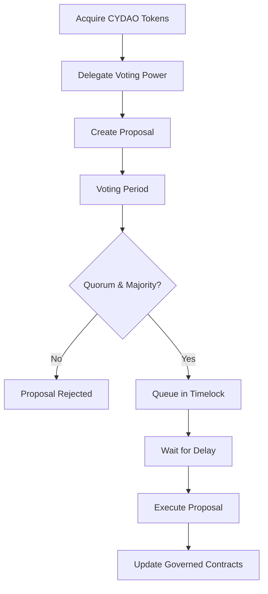

# CypherDAO

[](https://github.com/your-repo/CypherDAO/actions)
[](https://opensource.org/licenses/MIT)
[](https://soliditylang.org/)
[](https://openzeppelin.com/contracts/)
[](https://celo.org/)

> **CypherDAO**: Empowering decentralized governance on Celo. A robust, secure, and transparent on-chain governance system for protocol evolution through community consensus.

CypherDAO is a cutting-edge decentralized autonomous organization (DAO) framework designed for the Celo ecosystem. It enables token holders to participate in protocol governance by proposing, voting on, and executing changes via a secure timelock mechanism. Built with industry-leading standards, CypherDAO transforms centralized decision-making into a community-driven process, ensuring transparency, security, and alignment with ecosystem goals.

## 🚀 Key Highlights
- **Decentralized Decision-Making**: Token-based voting power with delegation capabilities.
- **Time-Locked Execution**: Prevents hasty changes with configurable delays.
- **Modular & Auditable**: Leverages OpenZeppelin contracts for battle-tested reliability.
- **Comprehensive Testing**: End-to-end proposal lifecycle validation.
- **Celo-Optimized**: Tailored for Celo's fast, stable, and carbon-negative blockchain.

---

## 📋 Table of Contents
- [Overview](#overview)
- [Philosophy](#philosophy)
- [Architecture](#architecture)
- [Core Components](#core-components)
- [Governance Flow](#governance-flow)
- [Quick Start](#quick-start)
- [API Reference](#api-reference)
- [Examples](#examples)
- [Deployment](#deployment)
- [Testing](#testing)
- [Security](#security)
- [Contributing](#contributing)
- [Community & Support](#community--support)
- [Roadmap](#roadmap)
- [FAQ](#faq)
- [License](#license)

---

## 📖 Overview

Traditional blockchain protocols rely on centralized teams for upgrades and changes, creating single points of failure and trust. CypherDAO addresses this by implementing a fully on-chain governance model where:

- **Token Holders** wield voting power proportional to their stake.
- **Proposals** are created, debated, and voted upon transparently.
- **Execution** is delayed via timelock to allow community review.

This system is ideal for protocols like LedgerLounge, cRepute, and cTipJar, enabling them to evolve democratically while maintaining security. Leveraging Celo's fast finality, low fees, and mobile-first design, CypherDAO enables efficient, inclusive governance for global communities.

### Why CypherDAO?
- **Transparency**: All proposals and votes are on-chain and verifiable.
- **Security**: Timelock prevents flash attacks; multi-sig like delays for critical actions.
- **Inclusivity**: Low barriers for participation; delegation for non-technical holders.
- **Scalability**: Modular design supports integration with any ERC20Votes token.

---

## 💡 Philosophy

At CypherDAO, we believe in **decentralized governance as the cornerstone of sustainable blockchain ecosystems**. Our principles:

- **Community First**: Decisions reflect collective will, not individual agendas.
- **Security by Design**: Every component is audited and tested against real-world scenarios.
- **Simplicity & Modularity**: Easy to integrate, hard to break.
- **Education & Accessibility**: Documentation and tools for learners and builders alike.

---

## 🏗️ Architecture

CypherDAO follows a layered architecture separating concerns for robustness and maintainability.

### High-Level Architecture Diagram
```mermaid
graph TD
    A[Token Holders] --> B[CypherDAO Token (CYDAO)]
    B --> C[Governor Contract]
    C --> D[Timelock Controller]
    D --> E[Governed Contracts]
    F[Proposals] --> C
    G[Votes] --> C
    H[Execution] --> D
```

- **Layer 1: Token Layer** - Manages voting power and delegation.
- **Layer 2: Governance Layer** - Handles proposals, voting logic, and quorum.
- **Layer 3: Execution Layer** - Timelock for delayed, secure execution.
- **Integration Layer** - Interfaces with governed protocols.

This separation ensures that failures in one layer don't compromise others.

### Component Interactions
- Token holders delegate votes to the CYDAO token.
- Proposals are submitted to the Governor, which validates and initiates voting.
- Passed proposals are queued in the Timelock for delayed execution.
- The Timelock executes changes on governed contracts.

---

## 🔧 Core Components

### 1. CypherDAO Token (CYDAO)
**ERC20Votes Extension**  
Represents governance power. Each token grants voting rights.

**Key Features:**
- **Delegation**: `delegate(address)` - Transfer voting power to another address.
- **Voting Power**: `getVotes(address)` - Query current votes for an account.
- **Checkpointing**: Historical voting power snapshots for past proposals.

**Example Usage:**
```solidity
// Delegate votes to self
cydaoToken.delegate(msg.sender);

// Check voting power
uint256 votes = cydaoToken.getVotes(userAddress);
```

### 2. Governor Contract
**OpenZeppelin Governor Base**  
Orchestrates the proposal lifecycle.

**Configuration Parameters:**
- `votingDelay`: Blocks before voting starts (e.g., 1 block).
- `votingPeriod`: Voting duration (e.g., 50400 blocks ~7 days).
- `proposalThreshold`: Minimum votes to propose (e.g., 1000 CYDAO).
- `quorum`: Minimum votes for passage (e.g., 4% of total supply).

**Core Functions:**
- `propose(targets, values, calldatas, description)`: Create a proposal.
- `castVote(proposalId, support)`: Vote (0=Against, 1=For, 2=Abstain).
- `queue(...)`: Queue passed proposal for execution.

### 3. Timelock Controller
**OpenZeppelin TimelockController**  
Enforces execution delays.

**Key Settings:**
- `minDelay`: Minimum delay (e.g., 172800 seconds ~2 days).
- `proposers`: Addresses that can schedule (Governor contract).
- `executors`: Addresses that can execute (anyone, or restricted).

**Operations:**
- `schedule(target, value, data, predecessor, salt, delay)`: Schedule execution.
- `execute(target, value, data, predecessor, salt)`: Execute after delay.

---

## 🔄 Governance Flow

The governance process is a 7-step cycle ensuring thorough review.

### Flow Diagram


**Step-by-Step:**
1. **Token Acquisition**: Obtain CYDAO tokens via airdrop, purchase, or staking.
2. **Delegation**: Delegate votes to yourself or a delegate.
3. **Proposal Creation**: Submit a proposal with targets, values, and calldatas.
4. **Voting**: Community votes during the period.
5. **Validation**: Check if quorum and majority are met.
6. **Queuing**: Successful proposals are queued with delay.
7. **Execution**: After delay, execute changes on governed contracts.

---

## 🚀 Quick Start

Get CypherDAO running in minutes.

### Prerequisites
- [Foundry](https://book.getfoundry.sh/getting-started/installation) installed.
- [Node.js](https://nodejs.org/) (optional, for tooling).
- Celo wallet with testnet funds.

### Installation
```bash
git clone https://github.com/your-repo/CypherDAO.git
cd CypherDAO
forge install
```

### Build & Test
```bash
forge build
forge test
```

### Local Deployment
```bash
anvil
forge script script/DeployCypherDAO.s.sol --fork-url http://localhost:8545 --broadcast
```

### First Proposal
1. Mint CYDAO tokens.
2. Delegate votes.
3. Propose a change (e.g., update a governed contract).
4. Vote and execute.

See [Examples](#examples) for detailed code.

---

## 📚 API Reference

### CypherDAO Token
- `mint(address to, uint256 amount)`: Mint tokens (admin only).
- `burn(uint256 amount)`: Burn tokens.
- `delegate(address delegatee)`: Delegate votes.
- `getPastVotes(address account, uint256 blockNumber)`: Historical votes.

### Governor Contract
- `propose(address[] targets, uint256[] values, bytes[] calldatas, string description)` → `uint256 proposalId`
- `getProposal(uint256 proposalId)` → Proposal details.
- `castVote(uint256 proposalId, uint8 support)`
- `hasVoted(uint256 proposalId, address account)` → bool

### Timelock Controller
- `schedule(address target, uint256 value, bytes data, bytes32 predecessor, bytes32 salt, uint256 delay)`
- `execute(address target, uint256 value, bytes data, bytes32 predecessor, bytes32 salt)`
- `cancel(bytes32 id)`: Cancel scheduled operation.

Full contract ABIs available in `out/` after build.

---

## 💻 Examples

### Delegating Votes
```solidity
// In your dApp or script
cydaoToken.delegate(userAddress);
```

### Creating a Proposal
```solidity
address[] memory targets = [governedContract];
uint256[] memory values = [0];
bytes[] memory calldatas = [abi.encodeWithSignature("setValue(uint256)", 42)];
string memory description = "Update value to 42";

uint256 proposalId = governor.propose(targets, values, calldatas, description);
```

### Voting on a Proposal
```solidity
governor.castVote(proposalId, 1); // 1 = For
```

See `test/CypherDAOGovernance.t.sol` for full lifecycle tests.

---

## 🚢 Deployment

### To Celo Testnet
```bash
export PRIVATE_KEY=your_private_key
forge script script/DeployCypherDAO.s.sol --rpc-url https://alfajores-forno.celo-testnet.org --broadcast --verify
```

### To Mainnet
```bash
forge script script/DeployCypherDAO.s.sol --rpc-url https://forno.celo.org --broadcast --verify
```

Post-deployment, update governed contracts to set Timelock as owner.

---

## 🧪 Testing

Run the full test suite:
```bash
forge test -v
```

Key tests include:
- Proposal creation and voting.
- Timelock delays.
- Edge cases (e.g., insufficient quorum).

Gas snapshots:
```bash
forge snapshot
```

---

## 🔒 Security

CypherDAO prioritizes security:
- **Audits**: Contracts based on audited OpenZeppelin libraries.
- **Timelock**: Prevents instant execution of malicious proposals.
- **Quorum Requirements**: Ensures broad consensus.
- **Access Controls**: Restricted functions for admins.

**Best Practices:**
- Always delegate votes carefully.
- Review proposals thoroughly before voting.
- Use multi-sig for critical deployments.

Report vulnerabilities to security@cypherdao.com.

---

## 🤝 Contributing

We welcome contributions! See [CONTRIBUTING.md](CONTRIBUTING.md) for guidelines.

### Development Workflow
1. Fork and clone.
2. Create a feature branch.
3. Write tests for changes.
4. Submit a PR with description.

### Code Standards
- Solidity: Follow [OpenZeppelin guidelines](https://docs.openzeppelin.com/contracts/5.x/).
- Testing: 100% coverage for new features.
- Documentation: Update README for API changes.

---

## 🌐 Community & Support

- **Discord**: [Join our community](https://discord.gg/cypherdao)
- **Forum**: [Discussions](https://forum.cypherdao.com)
- **Twitter**: [@CypherDAO](https://twitter.com/CypherDAO)
- **Docs**: [Full Documentation](https://docs.cypherdao.com)
- **Support**: support@cypherdao.com

---

## 🗺️ Roadmap

- **Q1 2026**: Frontend dApp for proposal management.
- **Q2 2026**: Cross-chain governance extensions.
- **Q3 2026**: Advanced voting mechanisms (quadratic voting).
- **Q4 2026**: Integration with Celo ecosystem protocols.

---

## ❓ FAQ

**Q: How do I get CYDAO tokens?**  
A: Participate in ecosystem activities or purchase on DEXs.

**Q: What if a proposal is malicious?**  
A: Community can vote against; timelock allows time to alert.

**Q: Can I change governance parameters?**  
A: Yes, via proposals targeting the Governor contract.

**Q: Is CypherDAO audited?**  
A: Built on audited OpenZeppelin; full audit planned.

---

## 📄 License

Licensed under [MIT](LICENSE). See [LICENSE](LICENSE) for details.

---

*Built with ❤️ for the Celo community. Empowering decentralized futures.*
  ```bash
  forge script script/DeployCypherDAO.s.sol --fork-url http://localhost:8545
  ```

---

## Usage

### Deploying to Celo
1. Set up your environment variables (RPC URL, private key).
2. Run the deployment script:
   ```bash
   forge script script/DeployCypherDAO.s.sol --rpc-url <CELO_RPC_URL> --private-key <YOUR_PRIVATE_KEY> --broadcast
   ```

### Interacting with the DAO
- **Propose**: Use Cast or a frontend to call `propose` on the Governor.
- **Vote**: Call `castVote` during the voting period.
- **Execute**: After queuing and delay, call `execute` on the Timelock.

For detailed interactions, refer to the test files in `test/`.

---

## Contributing

We welcome contributions from the community! Whether you're fixing bugs, adding features, or improving documentation, your input helps strengthen CypherDAO.

### Guidelines
- Follow Solidity best practices and OpenZeppelin guidelines.
- Write tests for new features.
- Use Foundry for development and testing.
- Submit pull requests with clear descriptions.

### Development Workflow
1. Fork the repo.
2. Create a feature branch.
3. Make changes and run tests.
4. Submit a PR.

For questions, join our Discord or open an issue.

---

## References
- [OpenZeppelin Governance Docs](https://docs.openzeppelin.com/contracts/5.x/api/governance)
- [OpenZeppelin Votes Contract](https://github.com/OpenZeppelin/openzeppelin-contracts/blob/master/contracts/governance/utils/Votes.sol)
- [Original Paste Reference](https://ppl-ai-file-upload.s3.amazonaws.com/web/direct-files/attachments/39848842/dd0313db-96c1-4a32-a694-511c4337f98e/paste.txt)

---

*CypherDAO: Empowering decentralized decision-making on Celo.*
